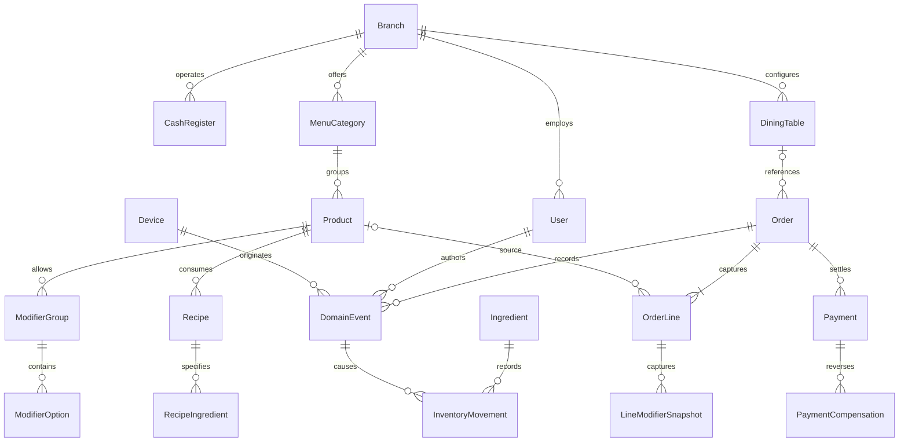

# Karma POS domain and order lifecycle (EVL-113)

This is the domain contract for the pilot, based on the EVL-111 decision record from 30 July 2026. Money is stored as integer MXN centavos. Prices include IVA and the ticket/reporting layer must show the IVA breakdown. Percentages and display strings are derived values; they are never the source of truth for money.

## Entity map

`OrderLine` owns a stable `lineId`, product ID, captured product name, unit price in centavos, quantity, selected modifier IDs/names/price deltas, notes, and the applied discount allocation. Later menu edits never rewrite these snapshots. Deleting or moving a line is a new event, not a rewrite of the capture history. A split creates new order/line identities that refer back to their source line and carries explicit allocated quantity, discount, payment, and table reference.

Every event has `eventId`, `commandId`, aggregate ID, type, schema version, actor/user ID, device ID, and an ISO timestamp. Events are immutable. A command has one stable ID across retries and contains one or more ordered events with identical command metadata. Persist the complete immutable command-batch document, including its receipt identity and all events, as one document and the idempotent commit point. A retry of that command with the identical complete batch is a no-op; a changed batch, mixed metadata, partial overlap, or ID reuse is a conflict. Read models and projections are derived from committed command-batch documents and can be rebuilt by replay; this contract does not assume atomic writes across multiple collections.

The pilot has one branch, one MXN currency, and one active cash-register writer. Other devices may send preparation events or read; only the active cash-register writer may mutate order lines, discounts, payments, and cash close. This is an access/coordination constraint for the later offline synchronization implementation, not a distributed lock implemented by this foundation issue.

## Independent order lifecycles

| Financial status | Meaning | Allowed next state |
| --- | --- | --- |
| `open` | Captured total has no net payments | `partially-paid`, `paid`, `void` |
| `partially-paid` | Net payments are greater than zero and below amount due | `partially-paid`, `paid`, `open` after a full payment reversal, `void` with required reason and compensation |
| `paid` | Net payments equal amount due, or a zero-total order settled without collecting money | Before close: `partially-paid` or `open` after a payment reversal. After close: remains `paid` when a refund compensation is appended, with due fixed at zero and no editing or new charge; `void` only with required reason and compensation |
| `void` | Order financially cancelled | terminal; any correction is a new order/event trail |

| Preparation status | Allowed next state | Event / effect |
| --- | --- | --- |
| `not-sent` | `queued`, `cancelled` | `PreparationSent` snapshots the current line versions; consume recipe inventory once here |
| `queued` | `preparing`, `cancelled` | `PreparationStarted` may be recorded by kitchen/bar |
| `preparing` | `ready`, `cancelled` | Mark ready or cancel with reason and compensating inventory movement |
| `ready` | `served`, `cancelled` | Mark served or cancel with reason and compensating movement |
| `served` | none | Terminal preparation state |
| `cancelled` | none | Terminal preparation state |

Financial payment and preparation are independent: registering payment never removes or completes a pending preparation. A preparation can be sent before, during, or after partial payment. Cancelling a paid order appends a payment refund/reversal event as applicable and separately reverses consumption; neither history is deleted. `amountDue` includes the allocated tip, and each payment's `netAmountCents` is its total charged amount including that payment's `tipCents` (`0 <= tip <= payment total`). For cash, `change = cashReceived - payment total`; cash received and change do not settle the order. Multiple payment methods may settle one order, but payment totals cannot exceed the amount due. A zero-total order settles as paid with no payment record. A pre-close reversal may reopen the amount due; once a sale is closed, refunds are compensating records against the original payment, retain closed status, leave due at zero, and cannot enable editing or another charge. Each refund carries an actor, timestamp, reason, and reference to the original payment.

`PreparationSent` is the inventory consumption point, matching EVL-111. It consumes each recipe ingredient using captured recipe/unit versions and records movement IDs linked to the source event. Retrying that command must not consume twice. Cancellation/refund does not erase consumption: append inverse movements linked to the original movements, retain who/when/reason, and update reports from the same event trail.

## Discount allocation and account splitting

An order-level discount in centavos is distributed across eligible line subtotals proportionally. Compute each exact share, assign its floor, then distribute remaining centavos by descending fractional remainder; ties are resolved by ascending stable `lineId` using locale-independent Unicode code-point ordering. The allocated cents must sum exactly to the discount, and no line may receive more discount than its subtotal. `allocateDiscount` implements this rule. When a line is split, carry its captured unit/modifier prices and allocated discount; reallocation over newly created line IDs is prohibited unless the user explicitly applies a new discount command.

Account/table moves and merging are not included in the pilot until confirmed. Mesa count is configurable and mesa assignment optional; once assigned, keep the reference through sale, comanda, and ticket. Reprinting is allowed only for Dueña or Encargado and requires a reason, per the finalized pilot decision.

## Related domain records

| Entity | Required captured facts |
| --- | --- |
| Branch / cash register | Stable IDs, branch currency (`MXN`), active writer device, register open/close events and accountable user |
| User / role | Stable ID, active state, role, actor identity on every protected event |
| Menu | Category/product/modifier IDs; current labels/prices are mutable catalog data, separate from order snapshots |
| Table / order | Optional configurable table reference, order type, contact snapshot; delivery requires name, phone, address; pickup requires name and phone |
| Payment / tip | Method, net centavos, tip centavos, cash tender/change where applicable, actor/time; tips accept 5/10/15/20% suggestions or any custom pesos and apply to every method |
| Ticket / comanda | Rendered from captured order snapshots and stable event identity; print/reprint does not mutate order or preparation |
| Ingredient / unit / recipe | Stable ingredient IDs, base unit, versioned recipe quantities; ingredient, finished product, and supply remain distinct kinds |
| Inventory movement | Movement/event ID, source event, quantity in base unit, unit snapshot, actor/device/time, reason, optional reversal reference |

## EVL-111 policy and unresolved items

Confirmed on 30 July 2026, with the credit and reprint details finalized for this pilot: prices include IVA and always show its breakdown; mesa count is configurable and mesa selection optional; consumption occurs when comanda is sent; cancellation/refund appends inverse inventory and reporting evidence; delivery/pickup fields are as above; tips have 5/10/15/20% suggestions plus arbitrary peso amounts and apply to all methods; gift cards are future scope; credit is used today. Roles are Dueña, Encargado, Barra (formerly cajero/barista), and Mesero (formerly cocina/barra). Dueña and Encargado may charge, cancel with reason, discount, edit menu/prices, adjust inventory, and view reports; only Dueña administers users; Barra may charge; Mesero may not charge. Credit is available only after Dueña approves each customer's limit; Barra and Encargado may apply credit and record repayments; Dueña and Encargado may adjust credit with an audit reason. Only Dueña and Encargado may reprint, and every reprint requires a reason.

Move-account and merge-account behavior remains deferred pending confirmation. Beyond required contact snapshots for delivery/pickup, no extra customer-data requirement is assumed. The MVP does not own historical backup/retention; user-managed CSV/Excel exports are the recovery archive, and cloud sync alone is not a historical backup. These decisions guide this contract; implementing role UI, offline sync, accounting reports, inventory, tickets, or credit workflows belongs to their respective roadmap issues.
